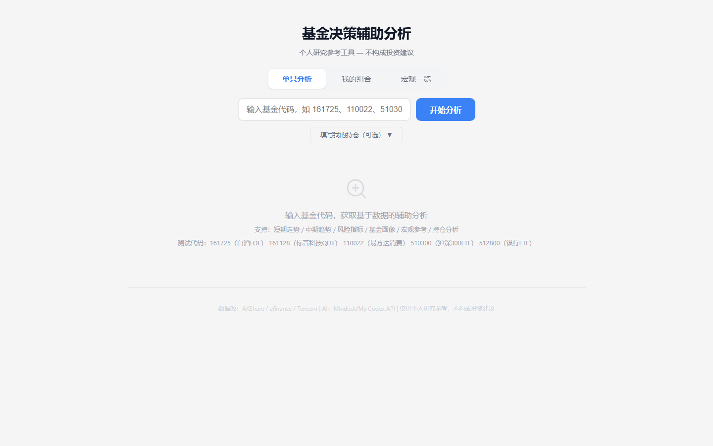
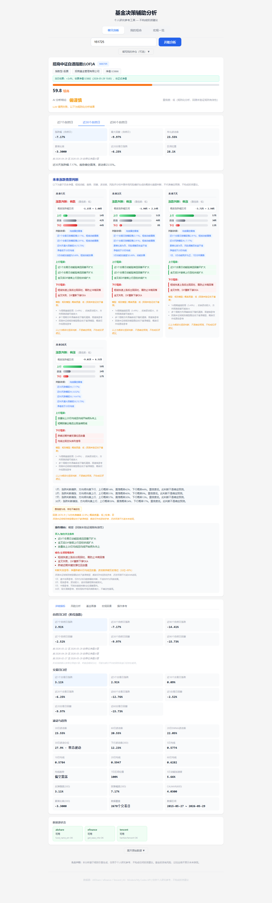
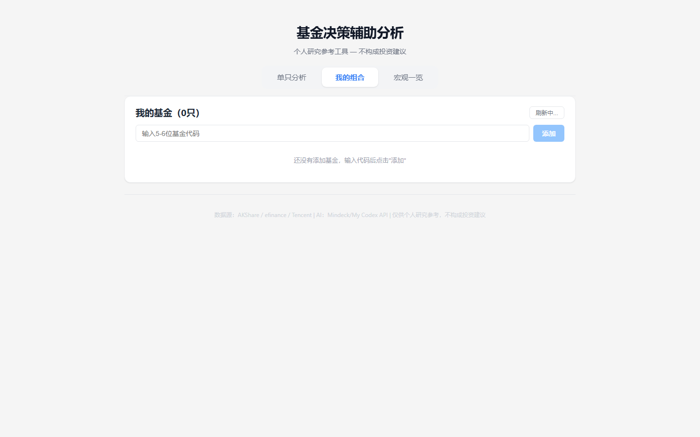
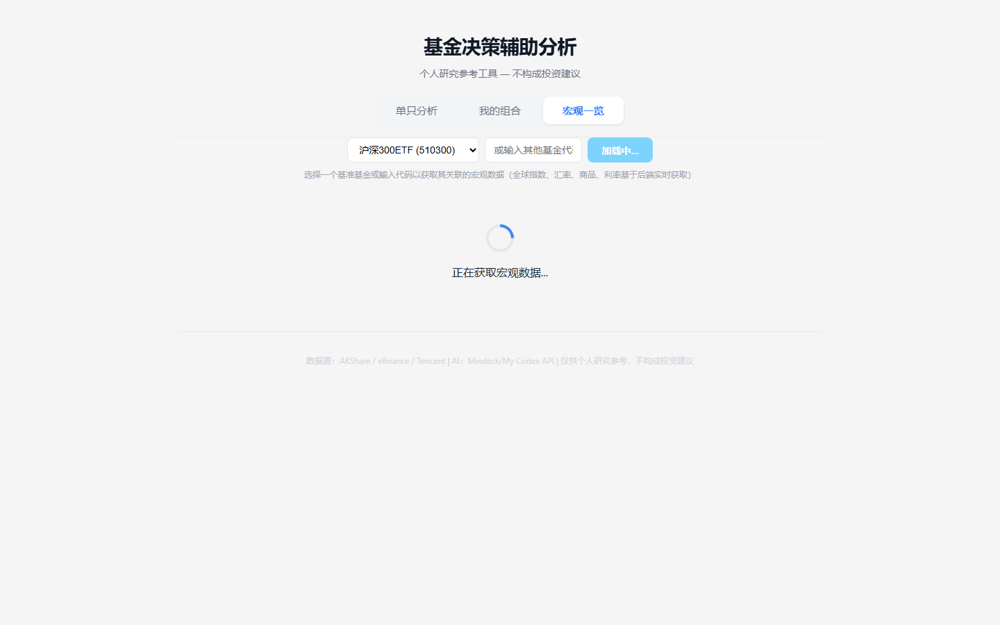

# 公募基金决策辅助分析 Agent

国内公募基金数据采集与 AI 辅助分析工具。输入基金代码，自动获取基金信息、技术指标、风险评分、回测验证和走势情景分析，并通过 LLM 输出中文辅助判断。

> **免责声明：本工具仅用于个人学习研究，不构成任何投资建议。基金投资有风险，过往业绩不预示未来表现。使用者应独立做出投资决策并承担相应风险。**

## 界面预览

### 基金分析 - 初始界面


### 基金分析 - 结果展示


### 个人持仓管理


### 宏观市场仪表盘


## 功能亮点

- 基金代码自动识别基金名称、类型、基金公司
- 基金画像（经理、规模、费率、风险等级、排名）
- 多维技术指标（涨跌幅、最大回撤、波动率、夏普比率、Calmar 比率、均线趋势）
- 结构化风险评分系统（0-100 分 + 多维度分解）
- 宏观因素参考（全球指数、汇率、商品）
- 个人持仓管理（成本价、定投、风险偏好），个性化分析
- 回测验证：历史方向准确率、Brier 分数、概率校准、基线对比
- 上涨概率验证：1/3/7/30 天“涨 / 不涨”二分类概率、历史命中率、基线对比和置信度
- 走势情景分析：1/3/7/30 天概率化情景判断
- LLM 中文分析总结（偏积极 / 中性 / 偏谨慎 / 风险较高）
- LLM 不可用时自动回退到规则化分析

## 技术栈

| 层 | 技术 |
|---|------|
| 后端 | Python 3.10+ / FastAPI / uvicorn |
| 数据 | akshare / efinance / Tencent fallback |
| LLM | OpenAI 兼容 API（支持任意兼容服务） |
| 前端 | React 18 + Vite 5 + TypeScript |
| CI | GitHub Actions |

## 项目结构

```
gold/
├── .github/workflows/
│   └── ci.yml                   # CI 配置
├── backend/
│   ├── main.py                  # FastAPI 入口，API 路由
│   ├── schemas.py               # Pydantic 数据模型
│   ├── storage.py               # user_funds.json 读写（原子写入）
│   ├── fund_data.py             # 基金信息与净值数据获取（多源 fallback）
│   ├── fund_profile.py          # 基金画像模块
│   ├── metrics.py               # 技术指标计算
│   ├── macro.py                 # 宏观因素数据
│   ├── risk_engine.py           # 风险评分引擎
│   ├── scoring.py               # 评分逻辑
│   ├── forecast_engine.py       # 走势情景分析引擎
│   ├── backtest_engine.py       # 回测验证引擎
│   ├── prediction_engine.py     # 上涨概率二分类预测与验证
│   ├── decision_advisor.py      # 买卖辅助判断规则
│   ├── agent.py                 # LLM 分析模块
│   ├── providers/
│   │   └── tencent_fund.py      # Tencent 净值估算
│   ├── requirements.txt
│   ├── .env.example
│   ├── test_backtest.py         # 回测模块测试
│   ├── test_prediction_engine.py # 上涨概率预测测试
│   ├── test_decision_advisor.py # 决策辅助测试
│   └── test_my_funds.py         # 持仓模块测试
├── frontend/
│   ├── src/
│   │   ├── App.tsx              # 主应用组件
│   │   ├── App.css              # 样式
│   │   ├── main.tsx             # 入口
│   │   ├── types.ts             # TypeScript 类型定义
│   │   ├── utils/
│   │   │   └── format.ts        # 格式化工具函数
│   │   └── components/
│   │       ├── AnalyzeView.tsx   # 单只基金分析视图
│   │       ├── PortfolioView.tsx # 我的组合视图
│   │       ├── MarketDashboard.tsx # 宏观一览
│   │       ├── ForecastBlock.tsx # 走势情景展示
│   │       ├── PortfolioComponents.tsx # 组合子组件
│   │       └── common.tsx        # 通用 UI 组件
│   ├── index.html
│   ├── package.json
│   ├── vite.config.ts
│   └── tsconfig.json
├── docs/
│   ├── architecture.md          # 架构文档
│   ├── api.md                   # API 接口文档
│   ├── interview-notes.md       # 面试准备笔记
│   └── demo-response.json       # 示例响应数据
├── .gitignore
├── LICENSE                      # MIT
└── README.md
```

## 快速开始

### 后端

```bash
cd backend

# 创建虚拟环境
python -m venv venv
# Windows
venv\Scripts\activate
# macOS / Linux
source venv/bin/activate

# 安装依赖
pip install -r requirements.txt

# 配置环境变量
cp .env.example .env
# 编辑 .env，按需填写 LLM_API_KEY 等

# 启动服务
python main.py
```

服务默认运行在 `http://127.0.0.1:8000`。

### 前端

```bash
cd frontend
npm install
npm run dev
```

开发服务器默认运行在 `http://localhost:3000`，自动代理 API 请求到后端。

## 环境变量

| 变量 | 说明 | 默认值 |
|------|------|--------|
| HOST | 服务监听地址 | 0.0.0.0 |
| PORT | 服务端口 | 8000 |
| CORS_ORIGINS | 允许的前端源（逗号分隔） | http://localhost:3000 |
| LLM_API_KEY | LLM API 密钥 | 空（不填则跳过 LLM 分析） |
| LLM_BASE_URL | LLM API 地址 | 空 |
| LLM_MODEL | LLM 模型名称 | 空 |
| LLM_TEMPERATURE | LLM 温度参数 | 0.3 |
| LLM_MAX_TOKENS | LLM 最大输出 token | 3000 |

## API 接口

| 方法 | 路径 | 说明 |
|------|------|------|
| GET | `/api/health` | 健康检查 |
| GET | `/api/macro` | 获取宏观一览数据 |
| GET | `/api/analyze?code=161725` | 分析单只基金 |
| POST | `/api/analyze` | 分析单只基金（可附带持仓信息） |
| GET | `/api/my-funds` | 获取个人基金列表 |
| POST | `/api/my-funds` | 新增/更新个人基金 |
| DELETE | `/api/my-funds/{code}` | 删除个人基金 |
| POST | `/api/my-funds/analyze` | 批量分析个人基金列表 |

详细接口文档见 [docs/api.md](docs/api.md)。

## 测试

所有测试使用 mock 数据，无需网络或 API Key 即可运行。

```bash
cd backend

# my-funds 模块测试（18 个用例：CRUD、文件读写、JSON 容错、原子写入、去重）
python -m unittest test_my_funds -v

# 回测模块测试（14 个用例：准确率、Brier 分数、校准、数据泄露检测等）
python test_backtest.py
```

## CI / GitHub Actions

每次 push 和 PR 自动运行（[ci.yml](.github/workflows/ci.yml)）：

- 后端：安装依赖 → 运行 my-funds 测试 → 运行回测测试
- 前端：`npm ci` → TypeScript 类型检查 → Vite 构建

所有 CI 步骤不依赖外部网络或真实 API Key，测试使用 mock 数据。

## 无网络 / 无 LLM 环境下体验

本项目设计为在以下条件下仍可正常运行：

### 不配置 LLM API Key
LLM 分析为可选模块。不配置 `LLM_API_KEY` 时：
- 系统自动跳过 LLM 调用
- 仍返回完整的技术指标、风险评分、回测结果和走势情景
- 分析结论回退为规则化文本描述

### 无网络 / 数据源不可用
- 数据采集模块按 AKShare → efinance → Tencent 优先级 fallback
- 所有数据源均不可用时，API 返回明确错误信息（不返回无效数据）

### 查看示例响应
`docs/demo-response.json` 包含一份完整的 API 响应示例，展示所有字段结构和数据含义。无需启动服务即可了解项目功能。

## 数据源说明

| 数据源 | 用途 | 说明 |
|--------|------|------|
| AKShare | 基金列表、净值历史、排名、全球指数 | 主数据源 |
| efinance | 基金基本信息、净值历史 | 备用数据源 |
| Tencent | ETF/LOF 行情、净值估算 | 辅助数据源 |

优先级：AKShare > efinance > Tencent。数据来源依赖第三方公开接口，稳定性不保证。各数据源的可用状态会随 API 响应一并返回（`datasource_status` 字段）。

## 风险评分说明

风险评分（0-100）由多维度加权计算，包括：
- 趋势评分：均线方向、价格位置、短期动量
- 回撤评分：历史最大回撤幅度
- 波动率评分：年化波动率水平
- 持仓评分：个人持仓盈亏状态（如有）
- 宏观评分：全球市场风险偏好

评分仅供参考，不构成买卖建议。实际投资决策应考虑个人风险承受能力、投资目标和市场环境。

## 回测验证

系统在分析过程中自动运行历史回测，计算规则模型的方向准确率、Brier 分数和概率校准质量。

- 回测仅反映历史表现，不代表未来结果
- 概率质量为"低"时，概率估计应视为低置信度参考
- 当规则模型未稳定优于基线模型时，系统会主动提示不确定性

## 项目截图

### 单只基金分析 — 初始状态


### 单只基金分析 — 分析结果（161725 招商白酒）


### 我的组合


### 宏观一览


## 未来可改进方向

- 前端可视化图表（净值曲线、风险雷达图）
- 数据库持久化替代 JSON 文件存储
- 前端路由拆分和懒加载
- Docker 容器化部署
- 更多基金类型支持（ETF、LOF 精细化分析）
- 历史回测结果缓存，减少重复计算
- 用户自定义评分权重

## 更多文档

- [架构文档](docs/architecture.md) — 前后端架构、数据流、模块职责
- [API 文档](docs/api.md) — 全部接口的参数和响应示例
- [面试准备笔记](docs/interview-notes.md) — 项目背景、技术难点、问答准备
- [示例响应](docs/demo-response.json) — 离线查看完整 API 响应结构

## License

MIT License — 详见 [LICENSE](LICENSE)。

本项目仅用于学习研究。数据来源依赖第三方公开接口（AKShare、efinance、Tencent），其稳定性和可用性不受本项目保证。
