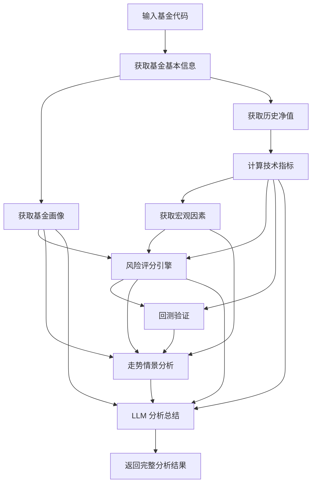

# 项目架构

## 整体架构

```
┌─────────────────────────────────────────────────┐
│                    Nginx / CDN                   │
│  frontend/dist  (static)  +  backend proxy      │
└──────────────┬──────────────────────────────────┘
               │
    ┌──────────┴──────────┐
    │                     │
    ▼                     ▼
┌─────────┐       ┌──────────────┐
│ 前端     │       │ 后端 API      │
│ React   │──────▶│ FastAPI       │
│ Vite    │  REST │ uvicorn       │
│ TS      │       │ Python 3.10+  │
└─────────┘       └──────┬───────┘
                         │
            ┌────────────┼────────────┐
            ▼            ▼            ▼
       ┌────────┐  ┌────────┐  ┌─────────┐
       │AKShare │  │efinance│  │ Tencent │
       │(主源)  │  │(备用)  │  │(辅助)  │
       └────────┘  └────────┘  └─────────┘
```

## 分析流程



## 数据流

```
用户请求
  │
  ├─ fund_data.py ──▶ AKShare / efinance / Tencent (fallback)
  │     ├── get_fund_info(code)       → {name, type, company, source}
  │     └── get_fund_nav_history(code) → DataFrame[净值日期, 单位净值, 日增长率]
  │
  ├─ fund_profile.py ──▶ AKShare / efinance
  │     └── get_fund_profile(code)    → {manager, size, fee, risk_level, ...}
  │
  ├─ metrics.py
  │     └── calculate_metrics(nav_df) → {returns, drawdown, volatility, sharpe, ...}
  │
  ├─ macro.py ──▶ AKShare
  │     └── get_macro_factors()       → {indices, forex, commodities, risk_factors}
  │
  ├─ risk_engine.py
  │     └── calculate_risk(...)       → {risk_score: 0-100, risk_level, dimensions}
  │
  ├─ backtest_engine.py
  │     └── run_backtest(nav_df)      → {accuracy, brier_score, calibration, ...}
  │
  ├─ forecast_engine.py
  │     └── generate_forecast(...)     → {1d/3d/7d/30d direction + probability}
  │
  └─ agent.py ──▶ LLM API (optional)
        └── analyze_with_llm(data)     → {conclusion, summary, risks, advice}
```

## 数据源 Fallback 策略

| 优先级 | 数据源 | 用途 | 失败时行为 |
|--------|--------|------|-----------|
| 1 | AKShare | 基金列表、净值、排名、指数 | 降级到 efinance |
| 2 | efinance | 基金信息、净值 | 降级到 Tencent |
| 3 | Tencent | ETF/LOF 行情 | 返回错误 |

所有数据源均不可用时，API 返回错误信息，不返回无效数据。

## LLM Fallback

- 配置了 `LLM_API_KEY` 时：调用 LLM API 生成中文分析总结
- 未配置时：跳过 LLM 分析，仅返回量化指标、风险评分、回测结果、走势情景
- LLM 调用失败（网络/ API 错误）时：返回规则化分析结果，`analysis` 字段包含基本趋势描述

## 风险评分在系统中的位置

风险评分（0-100）是多维度加权计算的综合指标：

```
risk_score = w1 × 趋势评分 + w2 × 回撤评分 + w3 × 波动率评分
           + w4 × 持仓评分 + w5 × 宏观评分
```

- 不是单一指标的简单映射
- 权重根据数据可用性动态调整
- 有持仓信息时启用持仓维度，无持仓时自动省略
- 评分仅反映历史数据特征，不预测未来走势

## 回测在系统中的位置

- **不是策略推荐**：回测验证的是系统内置规则模型的历史表现
- **概率质量评估**：判断模型输出的概率估计是否可信
- **不确定性提示**：当模型表现未稳定优于基线时，主动提示用户
- **数据泄露防护**：严格按时间切分训练/验证集

## 模块职责

| 模块 | 职责 | 依赖 |
|------|------|------|
| `main.py` | FastAPI 路由、请求协调 | 所有模块 |
| `schemas.py` | Pydantic 请求/响应模型 | 无 |
| `storage.py` | user_funds.json 读写 | 无 |
| `fund_data.py` | 基金数据获取（多源 fallback） | akshare, efinance |
| `fund_profile.py` | 基金画像信息 | akshare, efinance |
| `metrics.py` | 技术指标计算 | pandas, numpy |
| `macro.py` | 宏观因素数据 | akshare |
| `risk_engine.py` | 风险评分计算 | 无（纯计算） |
| `backtest_engine.py` | 回测验证 | pandas, numpy |
| `forecast_engine.py` | 走势情景分析 | 无（纯规则） |
| `agent.py` | LLM 分析 | openai |
| `providers/tencent_fund.py` | Tencent 数据接口 | httpx |
